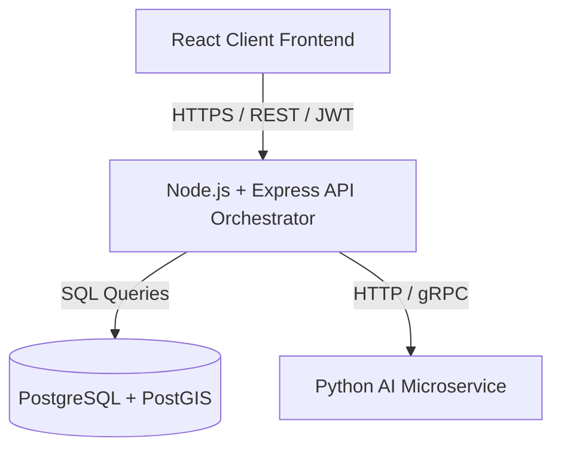

# System Architecture

CivicPulse AI follows a microservice-inspired "modular monolith" design. The platform leverages independent boundaries of concern to allow the frontend and backend to scale and integrate cleanly.

## Connection Flow
1. **Reporting Flow**: A citizen submits a report through the `[client/](file:///c:/Users/somva/civicpulse-ai/client)` dashboard.
2. **Persistence**: The `[server/](file:///c:/Users/somva/civicpulse-ai/server)` core API intercepts the HTTP request, validates the input body, stores the issue metadata in the `[issues](file:///c:/Users/somva/civicpulse-ai/docs/DATABASE_SCHEMA.md)` table, and returns a unique `issue_id` (format: `CP-YYYY-XXXXXX`).
3. **AI Handoff**: Once the record is saved, the Node API pushes the task to the `[ai/](file:///c:/Users/somva/civicpulse-ai/ai)` service asynchronously.
4. **Duplicate Search**: The Node orchestrator queries the database using PostGIS coordinates (`ST_DWithin`) to find matching issues within ~25 meters.
5. **Downstream Pipeline**: Handed off to priority and authority calculation before closing the loop.

## Ports Mapping
*   React Client: `5173`
*   Express API Server: `5000`
*   Python AI Server: `5001`
*   PostgreSQL + PostGIS DB: `5432`
